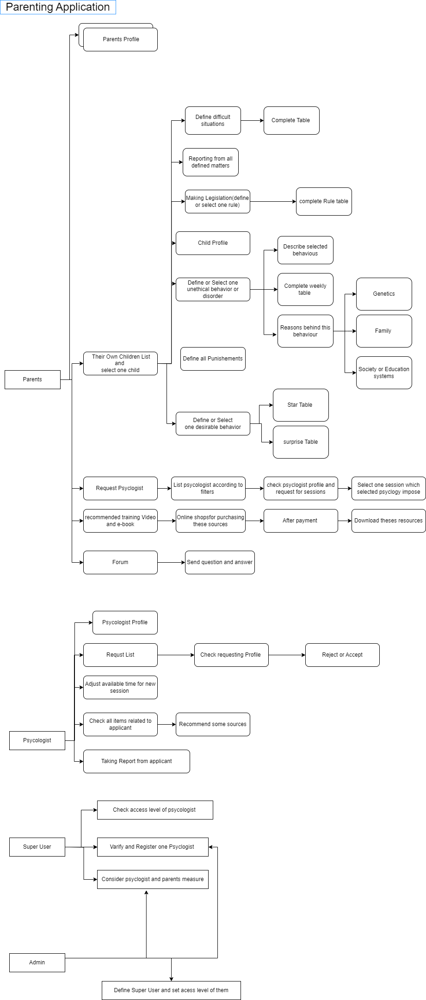

<div align="center">
<h1 align="center">Parenting_Project</h1>
<h3 align="center">Sample Project with base usage and deployment</h3>
</div>
<p align="center">
<a href="https://www.python.org" target="_blank">  </a>
<a href="https://www.postgresql.org" target="_blank">  </a>
<a href="https://www.django-rest-framework.org/" target="_blank">  </a>

</p>


# Parenting_Project
 Launched : September 2016
 
FaraIT company has been a long-time client, since before they launch this project.  I have helped them update and/or develop new projects before, and this project is only one case which allowed me to share with our costomers. I was glad to help this company.

# Why this application is formed :

1.	Lack of a comprehensive and coordinated online system for teaching, practicing and implementing parenting topics based on the current methods of the world
2.	Lack of regular and coordinated communication between children, parents, educators and psycologist to create desirable behavior
3.	Lack of tools to evaluate and check behavior changes
4.	Lack of access to parents who are interested and in need of parenting topics in any part of the country and the need for self-centered training or the help of counselors
5.	Failure to follow up and review cases and training provided in counseling sessions or case studies of parents
6.	lack of access to auxiliary tools to provide and track behavioral problems online and real-time and quantitative reports

# Available alternatives:

Holding scattered and uncoordinated psychological sessions across the country with limited parental access
value proposition
1.	The purpose of this program is to prevent the occurrence of behavioral, developmental, and emotional disorders in children by raising the level of knowledge, skills, and confidence of parents.
2.	It is a comprehensive and innovative system at the international level (system and applications) for training, practice and practical implementation of parenting topics by parents and the participation of all effective people in stabilizing specific behavior in children and adolescents based on the current PMT method.
3.	Detailed statistical reports to the responsible organizations on the type of problematic behaviors in different ages of the society for planning and applied studies as well as evaluating and guiding parents in a scientific and coordinated manner.
# Requirements:
•	HTML/CSS/ Bootstrap Template
•	Javascript/Jquery
•	Python/Django/REST Framework


# Some parts of Structure Database


# Clone the repo
Clone this repo anywhere you want and move into the directory:
```bash
git clone https://github.com/Ahmadzadeh920/Parenting_Project.git
```

# License
MIT.


# Bugs
Feel free to let me know if something needs to be fixed. or even any features seems to be needed in this repo.
